# P5.3 - Informe RA3: Despliegue de API REST en WildFly con Docker

## a) Componentes y funcionamiento del servidor

En mi despliegue participan estos componentes:

| Componente | Qué hace |
|------------|----------|
| **Docker** | Ejecuta el contenedor con WildFly |
| **WildFly** | Servidor de aplicaciones Jakarta EE |
| **Undertow** | Servidor web interno de WildFly (puerto 8080) |
| **crud-file.war** | Mi aplicación empaquetada |
| **Puerto 8080** | Acceso a la aplicación |
| **Puerto 9990** | Consola de administración |

### ¿Cómo llega una petición a mi código?

Cuando hago `curl http://localhost:8080/tasks/api/tasks`:

1. Docker recibe la petición en el puerto 8080
2. La reenvía al contenedor WildFly
3. Undertow (servidor web) analiza la URL `/tasks/api/tasks`
4. Busca la app con contexto `/tasks` → encuentra mi WAR
5. JAX-RS busca `@ApplicationPath("/api")` y `@Path("/tasks")`
6. Ejecuta el método `TaskResource.list()`
7. Convierte el resultado a JSON y lo devuelve

### Evidencias

**docker ps mostrando el contenedor activo:**

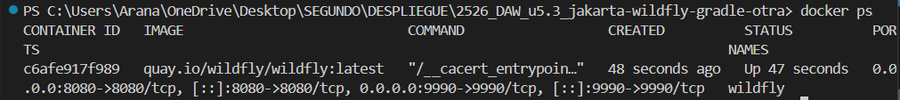

**Logs del servidor mostrando despliegue:**

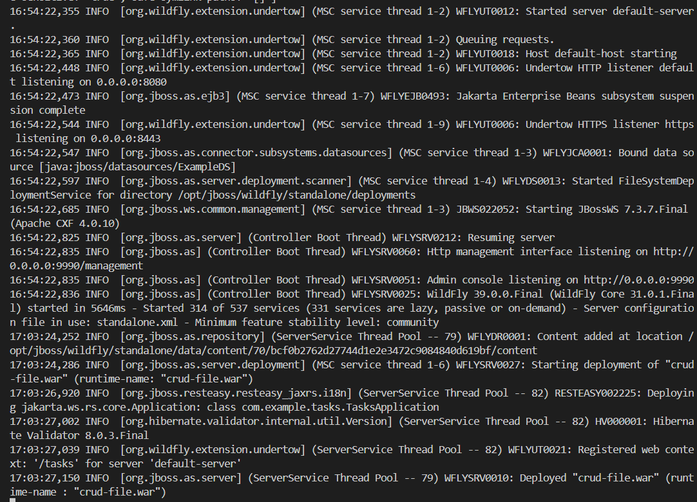

**Respuesta del endpoint con curl:**

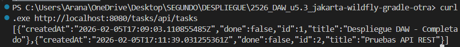

---

## b) Archivos de configuración y bibliotecas compartidas

### Archivo principal de WildFly

El archivo maestro de configuración es `standalone.xml`:

```
/opt/jboss/wildfly/standalone/configuration/standalone.xml
```

Ahí se configura todo: base de datos, seguridad, logs, puertos... Yo no lo he tocado porque para un despliegue básico no hace falta, pero en producción se modificaría para:
- Conectar a MySQL/PostgreSQL
- Configurar usuarios y roles
- Cambiar nivel de logs
- Ajustar timeouts

### Archivos de mi aplicación

| Archivo | Para qué sirve |
|---------|----------------|
| `web.xml` | Define que `index.html` es la página de inicio |
| `jboss-web.xml` | Define el contexto `/tasks` |
| `TasksApplication.java` | Define la ruta base `/api` |

### Dependencias "provided"

En mi `build.gradle` tengo:

```gradle
dependencies {
    compileOnly 'jakarta.platform:jakarta.jakartaee-api:10.0.0'
}
```

Uso `compileOnly` porque WildFly ya incluye todas las librerías de Jakarta EE. Así mi WAR pesa solo ~15 KB en vez de ~10 MB. Ventaja: menos conflictos y actualizaciones centralizadas.

### Evidencias

**Listado de archivos de configuración en el contenedor:**
```bash
docker exec -it wildfly ls /opt/jboss/wildfly/standalone/configuration/
```


**Mi build.gradle mostrando compileOnly:**

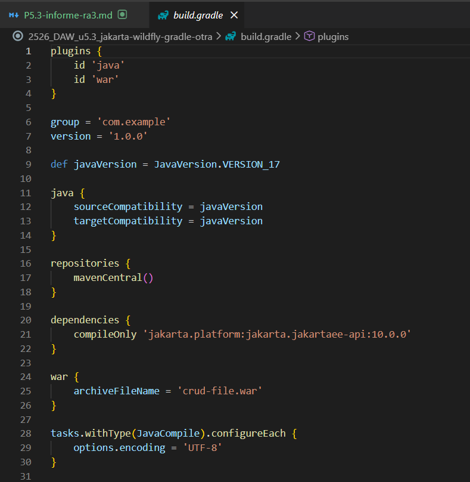

---

## c) Reverse proxy (Nginx) y HTTPS

### Problema actual

Ahora mismo accedo directamente a WildFly por el puerto 8080. En producción esto es mala práctica porque:
- No hay cifrado (HTTP plano)
- El puerto 9990 está expuesto
- No puedo balancear carga

### Solución: poner Nginx delante

La idea es que Nginx reciba todo el tráfico y lo reenvíe a WildFly internamente:

```
Usuario → Nginx (443 HTTPS) → WildFly (8080 interno)
```

### Configuración de Nginx propuesta

```nginx
upstream wildfly {
    server localhost:8080;
}

server {
    listen 80;
    return 301 https://$host$request_uri;  # Redirigir a HTTPS
}

server {
    listen 443 ssl;
    
    ssl_certificate /etc/nginx/ssl/certificado.crt;
    ssl_certificate_key /etc/nginx/ssl/clave.key;
    
    location /api/ {
        proxy_pass http://wildfly/tasks/api/;
        proxy_set_header Host $host;
        proxy_set_header X-Real-IP $remote_addr;
    }
    
    location / {
        proxy_pass http://wildfly/tasks/;
    }
}
```

### Configuración de HTTPS

Para obtener un certificado SSL gratuito usaría Let's Encrypt:

```bash
sudo apt install certbot python3-certbot-nginx
sudo certbot --nginx -d midominio.com
```

### ¿Qué cambiaría?

| Aspecto | Ahora | Con Nginx |
|---------|-------|-----------|
| Puerto público | 8080 | 443 (HTTPS) |
| Cifrado | No | Sí |
| Puerto 9990 | Expuesto | Oculto |
| Mi código Java | - | Sin cambios |

**¿Cambiaría algo en WildFly?** No. El cifrado lo hace Nginx, WildFly sigue recibiendo HTTP internamente.

### Evidencias

**Ejemplo de configuración nginx.conf:**

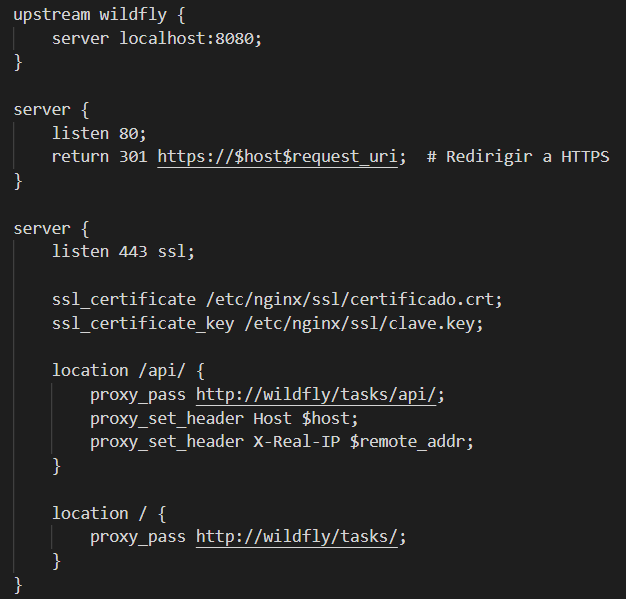

**Diagrama de arquitectura con Nginx:**


---

## d) Mecanismos de seguridad

### Lo que hice en la práctica

1. **Creé un usuario de administración** con `add-user.sh`
2. **Especifiqué qué puertos exponer** con `-p 8080:8080 -p 9990:9990`

### Lo que haría en producción (4 medidas mínimo)

| Medida | Qué haría | Por qué |
|--------|-----------|---------|
| **1. Ocultar puerto 9990** | No usar `-p 9990:9990` o usar `-p 127.0.0.1:9990:9990` | La consola de admin no debe ser accesible desde el navegador |
| **2. Gestión de secretos** | Usar Docker Secrets en vez de contraseñas en texto plano | Las contraseñas no deben estar en archivos ni en el código |
| **3. Logs persistentes** | Montar un volumen: `-v /logs:/opt/jboss/wildfly/standalone/log` | Si borro el contenedor, no pierdo los logs |
| **4. Limitar recursos** | Usar `--memory="2g" --cpus="1.5"` | Evitar que un ataque DoS tumbe todo el servidor |

### Evidencias

**docker ps mostrando puertos expuestos:**


**Creación del usuario de administración:**

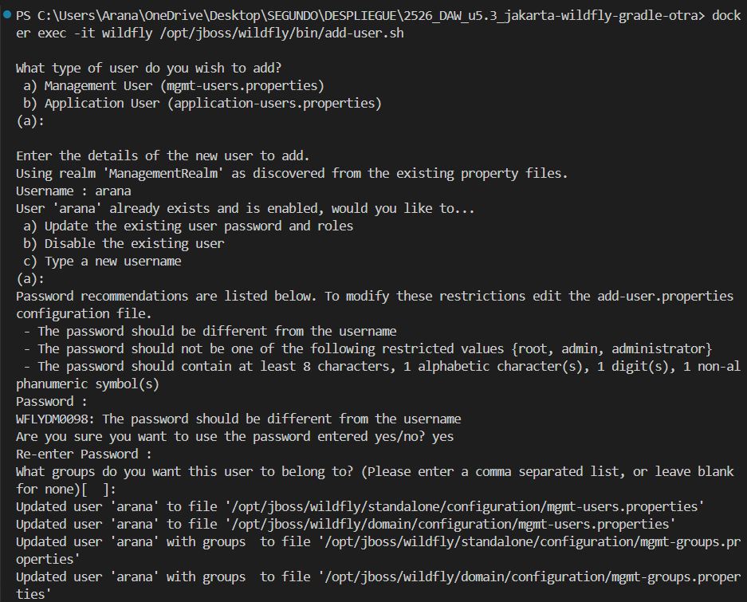

**Acceso a la consola de administración:**

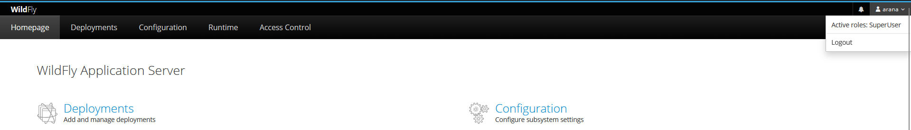

---

## e) Componentes web del servidor

### ¿Qué es el WAR?

El archivo `crud-file.war` es un ZIP que contiene mi aplicación:

```
crud-file.war
├── index.html              → Frontend
├── WEB-INF/
│   ├── web.xml            → Configuración web
│   ├── jboss-web.xml      → Contexto /tasks
│   └── classes/           → Mis clases Java compiladas
```

### El contexto de la aplicación

En `jboss-web.xml` definí:

```xml
<jboss-web>
    <context-root>/tasks</context-root>
</jboss-web>
```

Esto hace que mi app responda en `/tasks` en vez de `/crud-file`.

### Desglose de una URL

```
http://localhost:8080/tasks/api/tasks
│      │         │    │     │   │
│      │         │    │     │   └─ @Path("/tasks") en TaskResource.java
│      │         │    │     └───── @ApplicationPath("/api") en TasksApplication.java
│      │         │    └─────────── Contexto (jboss-web.xml)
│      │         └──────────────── Puerto mapeado por Docker
│      └────────────────────────── Mi máquina
└───────────────────────────────── Protocolo
```

### Evidencias

**Contenido de jboss-web.xml:**

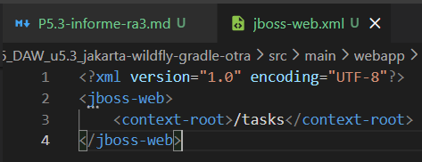

**Prueba en navegador (http://localhost:8080/tasks/):**

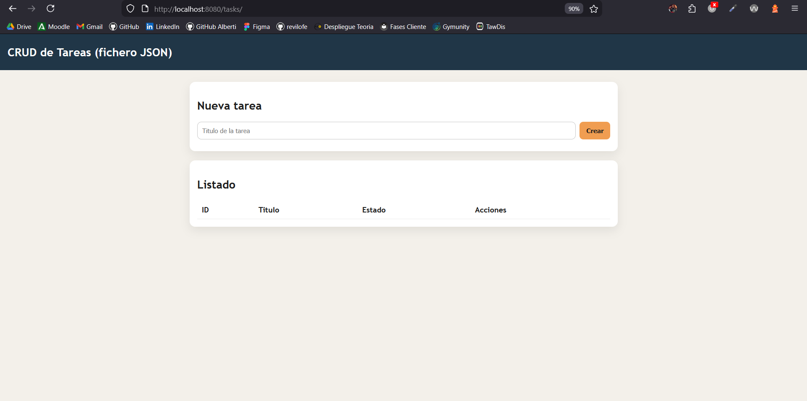

**Prueba de la API con curl:**

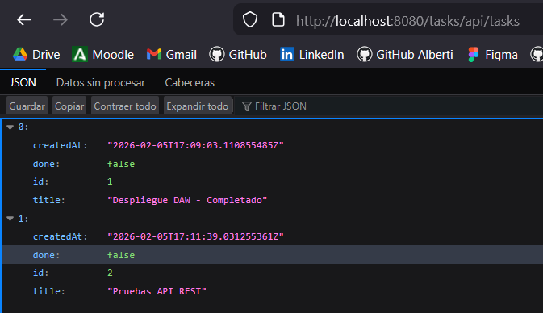

---

## f) Parámetros necesarios para el despliegue

### Comando docker run completo

```bash
docker run -d --name wildfly -p 8080:8080 -p 9990:9990 \
  quay.io/wildfly/wildfly:latest \
  /opt/jboss/wildfly/bin/standalone.sh -b 0.0.0.0 -bmanagement 0.0.0.0
```

### Explicación de cada parámetro

| Parámetro | Valor | Si falta o está mal... |
|-----------|-------|------------------------|
| `-d` | Modo daemon | El terminal queda bloqueado |
| `--name wildfly` | Nombre del contenedor | Docker asigna nombre aleatorio |
| `-p 8080:8080` | Puerto de la app | No puedo acceder a la aplicación |
| `-p 9990:9990` | Puerto de admin | No puedo acceder a la consola |
| `-b 0.0.0.0` | Escuchar en todas las IPs | La app solo sería accesible desde dentro del contenedor |
| `-bmanagement 0.0.0.0` | Admin en todas las IPs | Error "Unable to redirect" en la consola |

### Parámetros de Gradle

| En build.gradle | Valor | Si está mal... |
|-----------------|-------|----------------|
| `archiveFileName` | `crud-file.war` | El WAR tendría nombre largo |
| `compileOnly` | Jakarta EE API | WAR enorme o conflictos de clases |
| `sourceCompatibility` | Java 17 | No compila |

### Ruta de despliegue

```bash
docker cp build/libs/crud-file.war wildfly:/opt/jboss/wildfly/standalone/deployments/
```

Si copio a otra ruta, WildFly no detecta el WAR y no lo despliega.

### Evidencias

**Comando docker run ejecutado:**


**WAR generado en build/libs:**


**docker cp exitoso:**

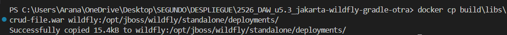

---

## g) Pruebas de funcionamiento y rendimiento

### Pruebas funcionales realizadas

| Prueba | Comando | Resultado esperado |
|--------|---------|-------------------|
| Listar tareas | `curl http://localhost:8080/tasks/api/tasks` | Array JSON |
| Crear tarea | `curl -X POST -H "Content-Type: application/json" -d '{"title":"Test"}' http://localhost:8080/tasks/api/tasks` | Status 201 |
| Obtener tarea | `curl http://localhost:8080/tasks/api/tasks/1` | Objeto JSON |
| Actualizar | `curl -X PUT -H "Content-Type: application/json" -d '{"title":"Modificado"}' http://localhost:8080/tasks/api/tasks/1` | Tarea actualizada |
| Eliminar | `curl -X DELETE http://localhost:8080/tasks/api/tasks/1` | Status 204 |

### Prueba de rendimiento con hey

**Comando ejecutado:**
```bash
hey -n 1000 -c 10 http://localhost:8080/tasks/api/tasks
```

**Parámetros:**
- `-n 1000`: 1000 peticiones totales
- `-c 10`: 10 usuarios simultáneos

**Resultados obtenidos:**

| Métrica | Valor |
|---------|-------|
| Tiempo total | 0.1957 segundos |
| Peticiones/segundo | **5110.16 req/sec** |
| Respuesta más rápida | 0.5 ms |
| Respuesta más lenta | 32.1 ms |
| Promedio | 1.9 ms |

**Distribución de latencia:**
- 50% de las peticiones: < 1.4 ms
- 90% de las peticiones: < 2.4 ms
- 99% de las peticiones: < 26.8 ms

**Análisis:** El servidor procesa más de 5000 peticiones por segundo sin errores. El 99% de las peticiones se completan en menos de 27 ms, lo que indica un rendimiento excelente y estable. La mayoría de peticiones (970 de 1000) se completaron en menos de 4 ms.

### Evidencias

**GET listar tareas:**

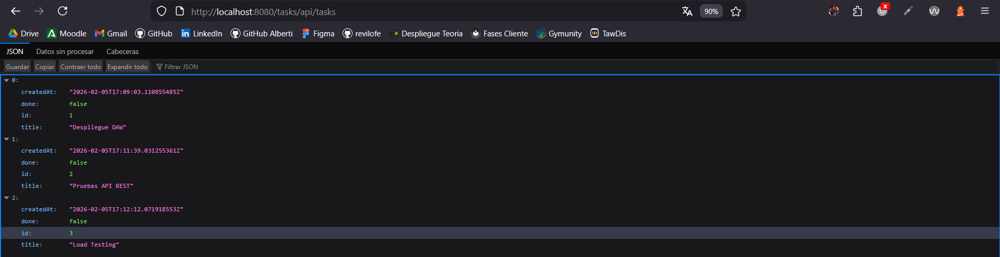

**POST crear tarea:**


**PUT actualizar tarea:**

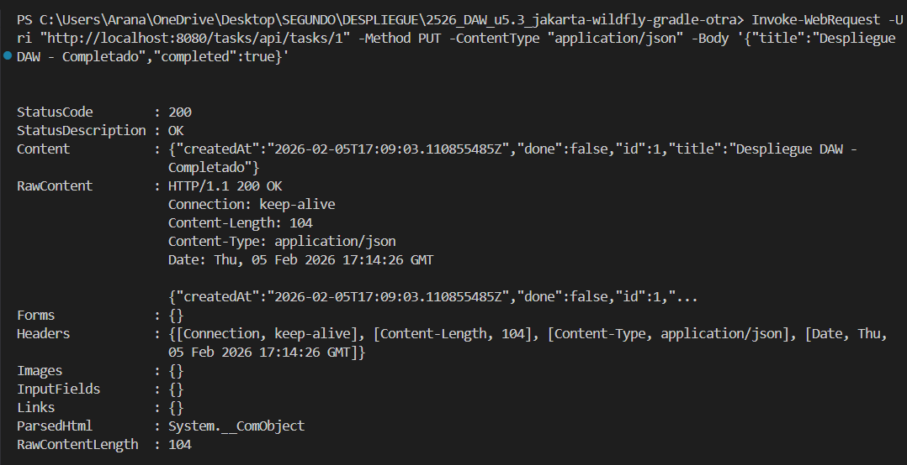

**DELETE eliminar tarea:**

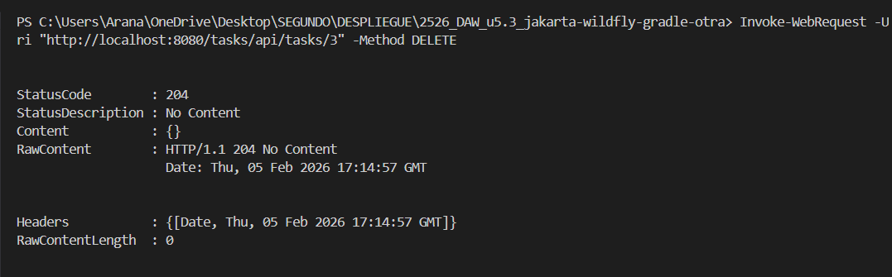

**Resultado completo de hey:**

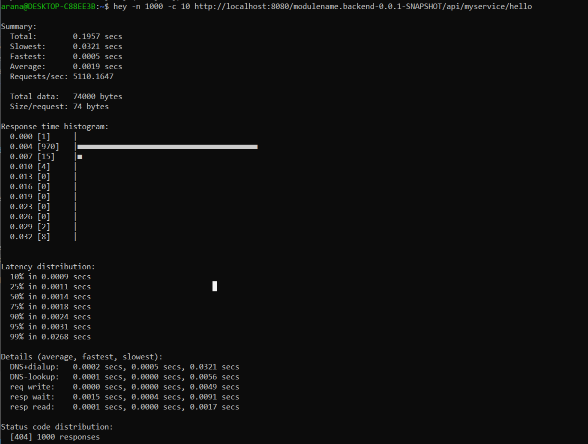

---

## h) Documentación de administración

Esta es la guía para que cualquiera pueda reproducir el despliegue.

---

### Arquitectura del despliegue

```
┌─────────────────┐      ┌─────────────────────────────────┐
│   Cliente       │      │   Contenedor Docker (wildfly)   │
│   (navegador/   │ 8080 │  ┌─────────────────────────┐    │
│    curl)        │─────▶│  │  WildFly + Undertow     │    │
│                 │      │  │  crud-file.war (/tasks) │    │
└─────────────────┘      │  └─────────────────────────┘    │
                         └─────────────────────────────────┘
```

---

### 1. Cómo levantar WildFly

```bash
# Descargar imagen
docker pull quay.io/wildfly/wildfly:latest

# Levantar contenedor
docker run -d --name wildfly -p 8080:8080 -p 9990:9990 \
  quay.io/wildfly/wildfly:latest \
  /opt/jboss/wildfly/bin/standalone.sh -b 0.0.0.0 -bmanagement 0.0.0.0

# Crear usuario admin (seguir las instrucciones que pone en la terminal)
docker exec -it wildfly /opt/jboss/wildfly/bin/add-user.sh
```

---

### 2. Cómo desplegar una nueva versión del WAR

```bash
# Compilar el proyecto
./gradlew clean build

# Copiar el WAR al contenedor
docker cp build/libs/crud-file.war wildfly:/opt/jboss/wildfly/standalone/deployments/
```

WildFly detecta automáticamente el nuevo WAR y lo despliega.

---

### 3. Cómo comprobar el estado

**Ver si el contenedor está activo:**
```bash
docker ps
```

**Ver logs del servidor:**
```bash
docker logs wildfly
```

**Probar que la API responde:**
```bash
curl http://localhost:8080/tasks/api/tasks
```

---

### 4. URLs de prueba

| URL | Qué hace |
|-----|----------|
| `http://localhost:8080/tasks/` | Frontend web |
| `http://localhost:8080/tasks/api/tasks` | API REST (listar tareas) |
| `http://localhost:9990` | Consola de administración |

---

### 5. Comandos útiles

| Acción | Comando |
|--------|---------|
| Ver contenedores | `docker ps` |
| Ver logs | `docker logs wildfly` |
| Entrar al contenedor | `docker exec -it wildfly /bin/bash` |
| Detener | `docker stop wildfly` |
| Reiniciar | `docker restart wildfly` |
| Eliminar | `docker rm -f wildfly` |

---

### 6. Errores comunes y soluciones

| Error | Causa | Solución |
|-------|-------|----------|
| "Connection refused" en 8080 | Contenedor parado | `docker start wildfly` |
| "Unable to redirect" en 9990 | Falta `-bmanagement 0.0.0.0` | Recrear contenedor con el parámetro |
| WAR no se despliega | Ruta incorrecta | Copiar a `/opt/jboss/wildfly/standalone/deployments/` |
| Build failed | Java incorrecto | Instalar Java 17 |

---

### 7. Pruebas de funcionamiento

```bash
# Crear tarea
curl -X POST -H "Content-Type: application/json" \
  -d '{"title":"Nueva tarea"}' \
  http://localhost:8080/tasks/api/tasks

# Listar tareas
curl http://localhost:8080/tasks/api/tasks

# Actualizar tarea
curl -X PUT -H "Content-Type: application/json" \
  -d '{"title":"Tarea modificada"}' \
  http://localhost:8080/tasks/api/tasks/1

# Eliminar tarea
curl -X DELETE http://localhost:8080/tasks/api/tasks/1
```

---

### 8. Pruebas de rendimiento

```bash
hey -n 1000 -c 10 http://localhost:8080/tasks/api/tasks
```

Resultado esperado: más de 1000 req/sec sin errores.

---

### 9. Recomendaciones de seguridad

- **No exponer el puerto 9990** en producción
- **Usar volúmenes** para persistir logs: `-v ./logs:/opt/jboss/wildfly/standalone/log`
- **Limitar recursos** del contenedor: `--memory="2g" --cpus="1.5"`
- **Cambiar contraseñas** por defecto del usuario admin
- **Usar HTTPS** con un proxy Nginx delante

---

### 10. Ficheros Docker

**docker-compose.yml** (ver apartado i para versión completa con Nginx):

```yaml
version: '3.8'
services:
  wildfly:
    image: quay.io/wildfly/wildfly:latest
    container_name: wildfly
    ports:
      - "8080:8080"
    volumes:
      - ./build/libs/crud-file.war:/opt/jboss/wildfly/standalone/deployments/crud-file.war
    command: /opt/jboss/wildfly/bin/standalone.sh -b 0.0.0.0
    restart: unless-stopped
```

---

## i) Docker Compose

Frontend (Nginx) y Backend (WildFly) en contenedores separados. El backend NO está expuesto al host.

### docker/frontend/Dockerfile

```dockerfile
FROM nginx:alpine
COPY nginx.conf /etc/nginx/nginx.conf
COPY ../../src/main/webapp/index.html /usr/share/nginx/html/
```

### docker/frontend/nginx.conf

```nginx
events { worker_connections 1024; }

http {
    server {
        listen 80;
        location / { proxy_pass http://backend:8080/tasks/; }
        location /api/ { proxy_pass http://backend:8080/tasks/api/; }
    }
}
```

### docker/backend/Dockerfile

```dockerfile
FROM quay.io/wildfly/wildfly:latest
COPY ../../build/libs/crud-file.war /opt/jboss/wildfly/standalone/deployments/
CMD ["/opt/jboss/wildfly/bin/standalone.sh", "-b", "0.0.0.0"]
```

### docker-compose.yml

```yaml
version: '3.8'

services:
  frontend:
    build: ./docker/frontend
    ports:
      - "80:80"
    volumes:
      - ./logs/nginx:/var/log/nginx
    depends_on:
      - backend
    restart: unless-stopped
    mem_limit: 256m
    networks:
      - app-network

  backend:
    build: ./docker/backend
    expose:
      - "8080"
    volumes:
      - ./logs/wildfly:/opt/jboss/wildfly/standalone/log
    restart: unless-stopped
    mem_limit: 1g
    healthcheck:
      test: ["CMD", "curl", "-f", "http://localhost:8080/tasks/api/tasks"]
      interval: 30s
      retries: 3
    networks:
      - app-network

networks:
  app-network:
    driver: bridge
```

### Comandos

```bash
./gradlew clean build
docker-compose up -d --build
docker-compose ps
docker-compose logs -f
docker-compose down
```